# Assignment 3 — Responsive Web Design
*Name:* Ainabek Chingiskhan
*Group:* IT-2502
## Project Overview
This project demonstrates responsive web design using CSS media queries
and Bootstrap's 12-column grid.
## Pages
- index.html — responsive typography and layout using CSS media queries.
- bootstrap.html — Bootstrap responsive columns and navigation bar.
- portfolio.html — portfolio combining Bootstrap and custom media queries.
## How to Run
Open index.html, bootstrap.html, or portfolio.html in a browser.
An internet connection is required to load Bootstrap.
## Part 1 — Media Queries
### Task 0 — Responsive Typography
I used CSS media queries to change heading and paragraph sizes:
- Below 768px: heading 28px, paragraph 16px.
- From 768px to below 992px: heading 36px, paragraph 18px.
- From 992px: heading 44px, paragraph 20px.
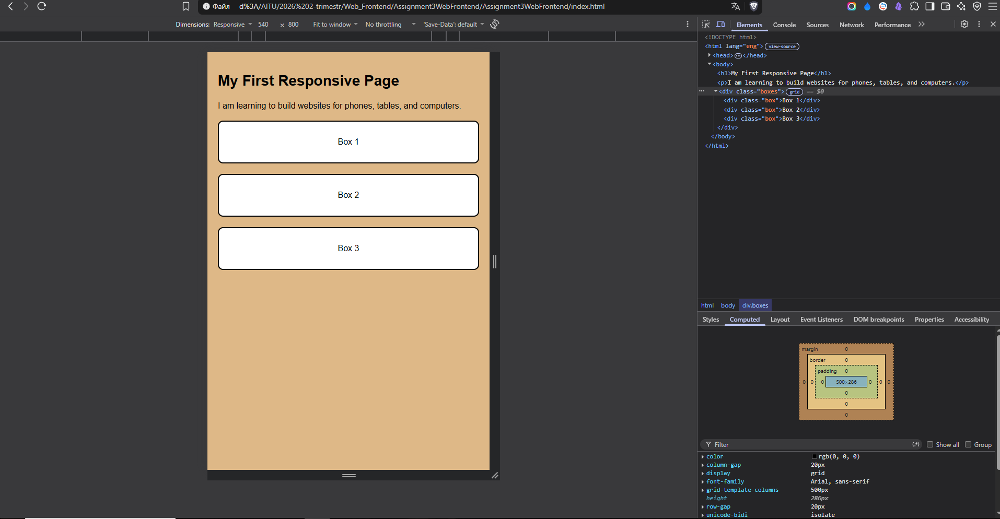
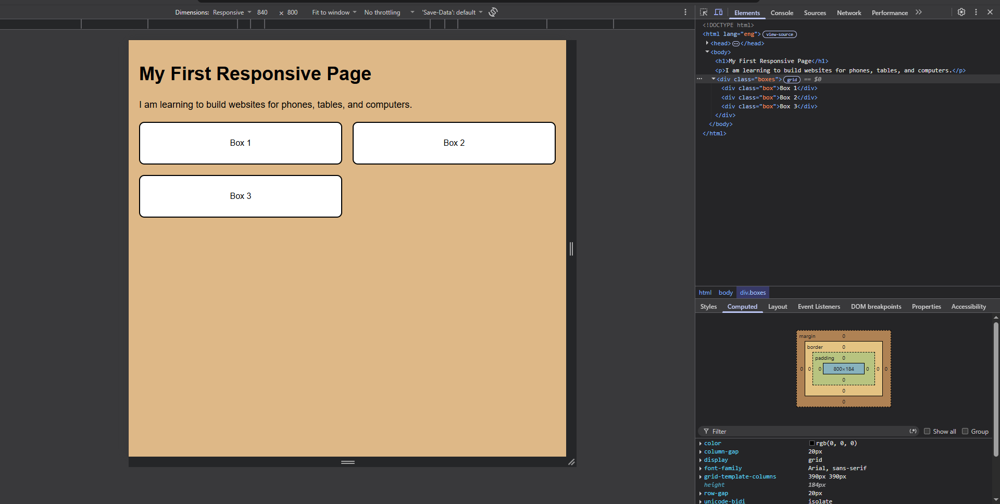
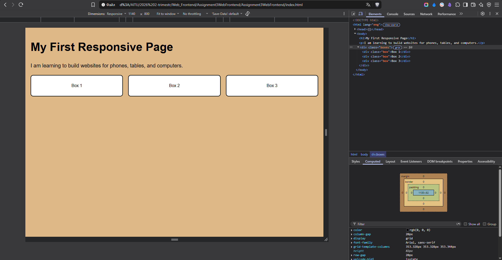
### Task 1 — Responsive Layout
I used CSS Grid and media queries without Bootstrap:
- Below 768px: one column.
- From 768px to below 992px: two columns.
- From 992px: three columns.

## Part 2 — Bootstrap
### Task 2 — Responsive Columns
I used Bootstrap's 12-column grid with these classes:
col-12 col-md-6 col-lg-4.
- Below 768px: each column uses the full row width.
- From 768px to below 992px: two columns fit in the first row,
  and the third moves to the second row.
- From 992px: three equal columns fit in one row.
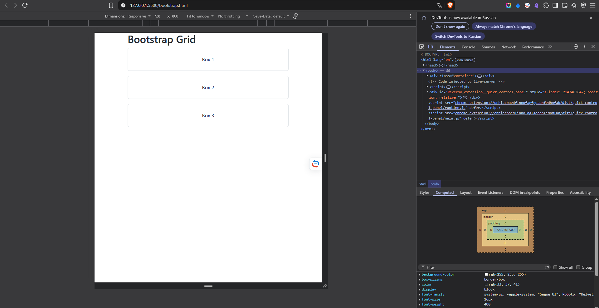
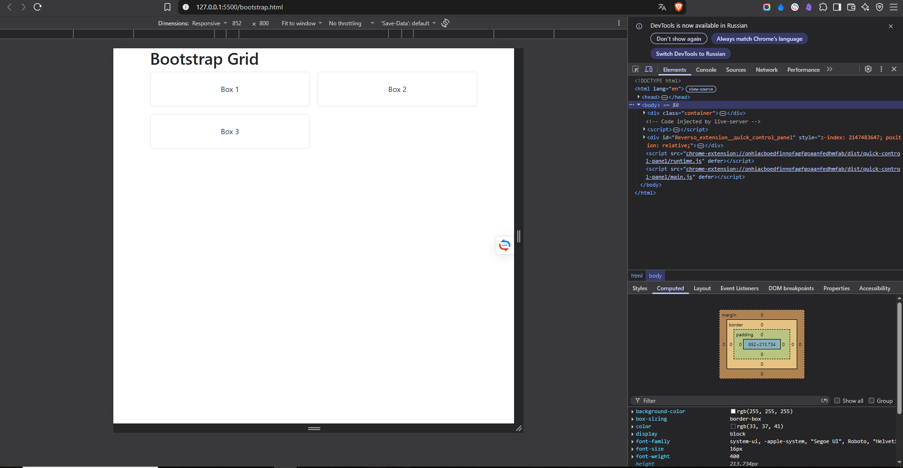
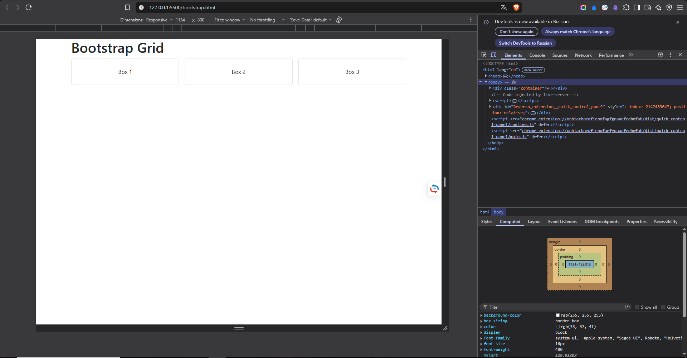
### Task 3 — Responsive Navigation Bar
The navigation bar has a text logo on the left and links on the right
on large screens.
Below 992px, the links collapse into a hamburger menu.
Bootstrap JavaScript allows the button to open and close the menu.
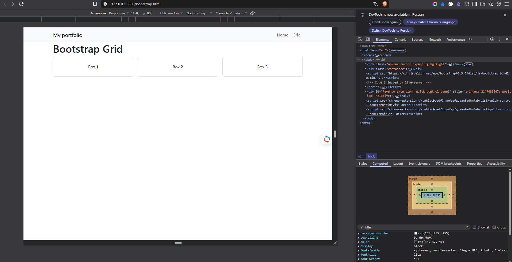

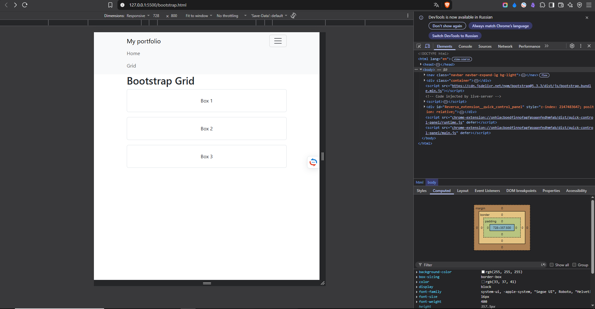
## Part 3 — Combined Project
### Task 4 — Responsive Portfolio
I combined Bootstrap Grid with custom CSS media queries.
The page includes:
- A responsive Bootstrap navbar.
- Project cards arranged with Bootstrap Grid.
- A sidebar with personal information and contact details.
- A full-width footer.
On large screens, the projects use 8 grid columns and the sidebar
uses 4. Below 992px, the sidebar moves below the projects.
Custom media queries change the heading size and main section padding:
- Below 768px: heading 28px, vertical padding 12px.
- From 768px to below 992px: heading 36px, vertical padding 24px.
- From 992px: heading 44px, vertical padding 36px.
The introduction paragraph is hidden below 768px and visible
on wider screens.
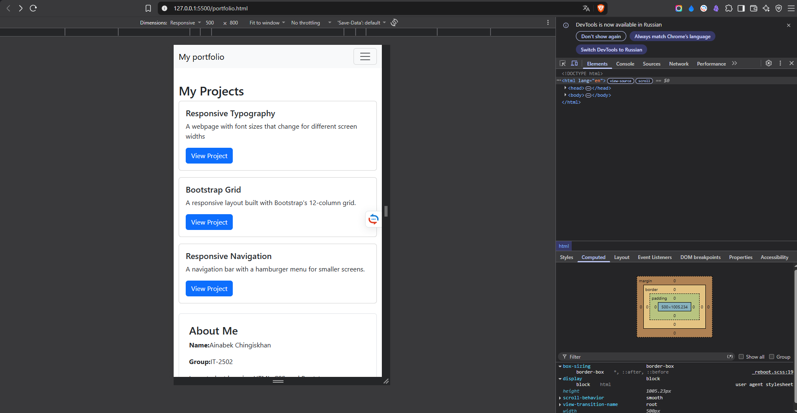
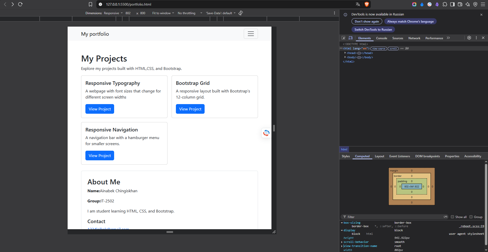
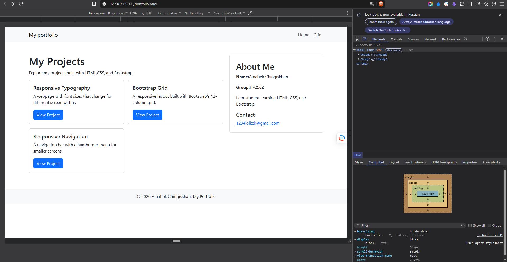
## Work Process Summary
I started with a simple HTML page and added CSS media queries
for responsive typography and layout.
Then I used Bootstrap to create responsive columns and a collapsible
navigation bar. Finally, I combined these techniques in a portfolio.
I tested the pages at different viewport widths using browser
developer tools. During testing, I corrected CSS property names
and Bootstrap class names.